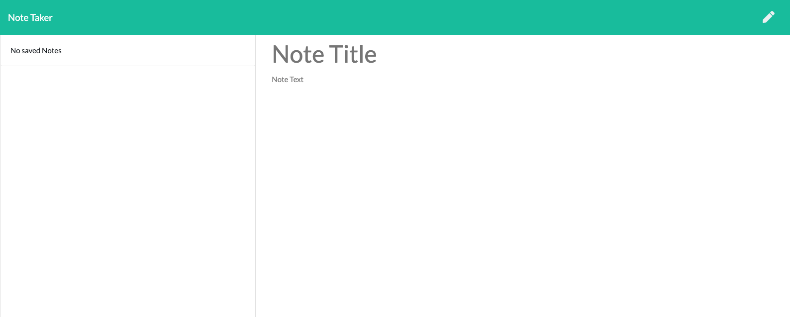

 # Note_Taker
   

  
  
  ### Table of Contents
  * [Description](#project-description)
  * [Installation](#installation)
  * [Contribution](#contributions)
  * [Questions](#questions)
  * [License](#license)
  
  ### Project Description
  This is a web app that enables you to write notes and revisit them later.

  ### Installation
  Simply clone this repo and run "npm install" from the terminal. After that, run command "npm start" to boot up your server. This will enable the site to go live, hosted by your computer, at http://localhost:3001/ in your browser. You may also simply visit the heroku link for the deployed app: https://dry-brushlands-49211.herokuapp.com/notes.

  ### Contributions
  Contributions are welcome!

  ### Questions
  wfh2d88@gmail.com   

  https://github.com/william-hunt88

  https://github.com/william-hunt88/Note_taker
  
  
  Licensed under the [MIT](https://github.com/william-hunt88/Note_taker/blob/main/LICENSE.txt) license
